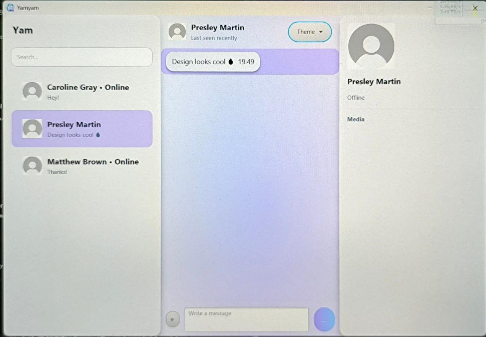
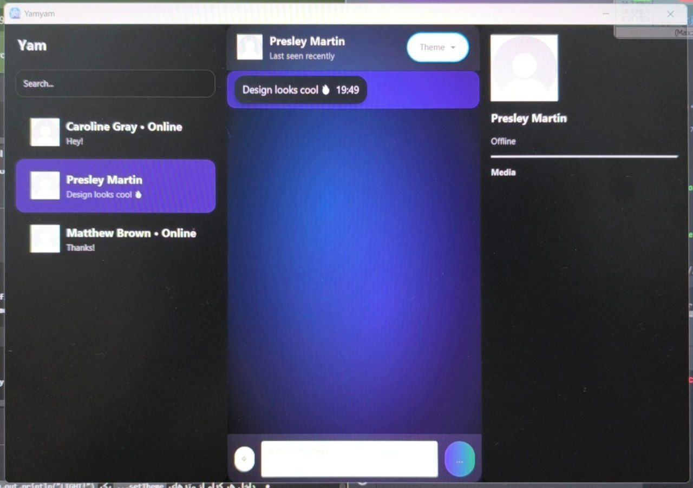
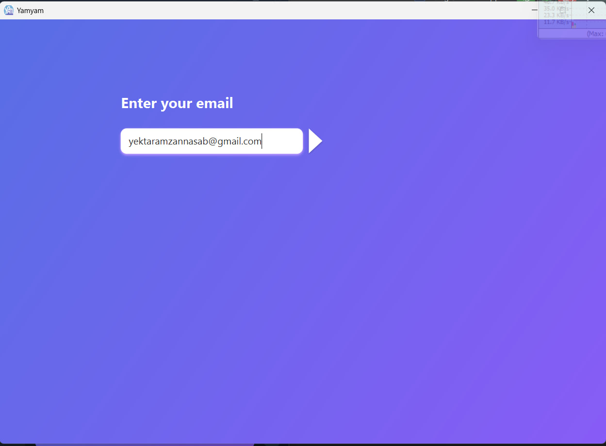
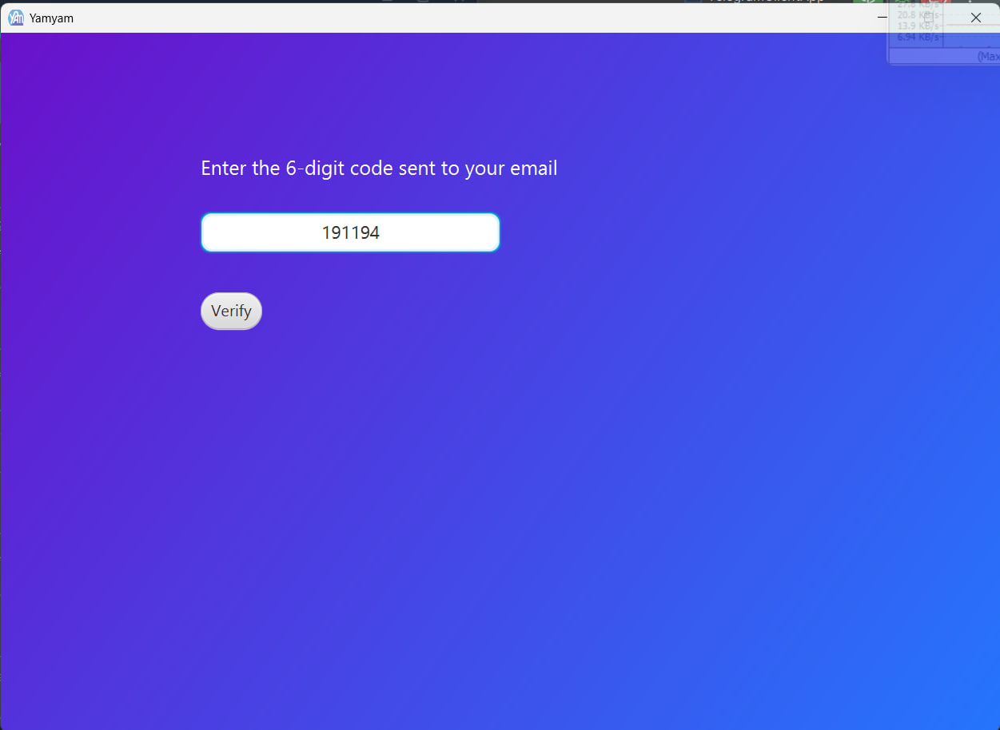
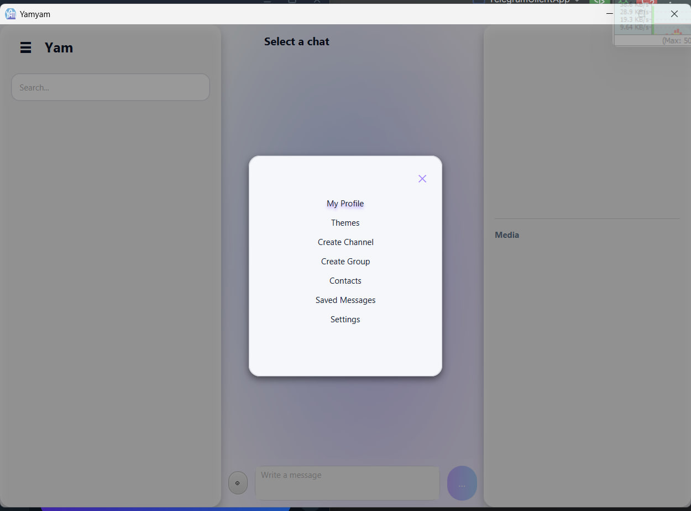
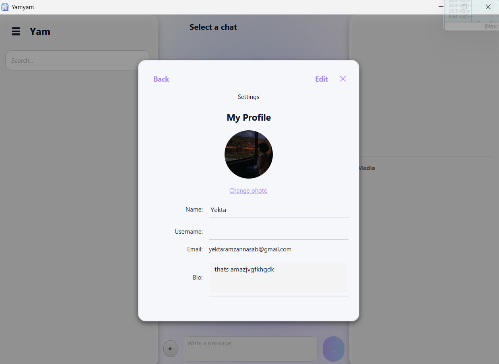
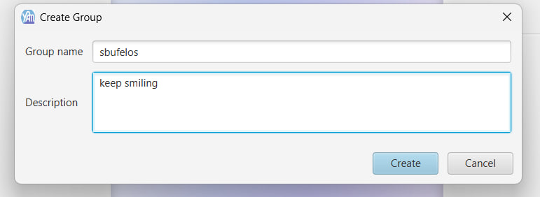
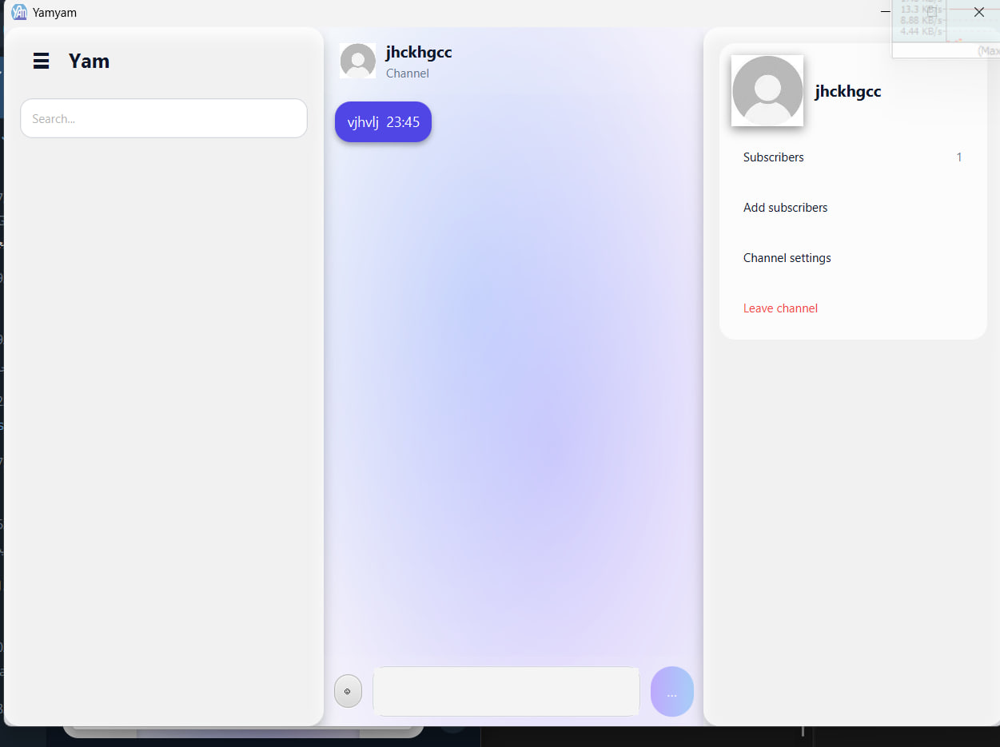

# YAM Messenger

A powerful and scalable Java-based messenger designed with a multi-layered architecture, an optimized database, and a custom socket-based API. This project includes comprehensive features such as private chats, groups, and channels, an advanced search system, cache management, and an API for building intelligent bots.

## ✨ Key Features

  * Complete Chat System: Supports private chats, groups, and channels with an inheritance structure at both the code and database levels.
  * Optimized Search: Ultra-fast search for users, groups, and channels using database indexing (search-vector).
  * Smart Cache Management (`DataManager`): Significantly increases data loading speed by caching frequently accessed data. If the data is not in the cache, it is fetched from the database and stored in the cache.
  * Bot API: Enables the creation of intelligent and interactive bots that connect directly to the core system, allowing users to interact with them.
  * Message Operations: Full support for editing, deleting, and replying to messages.
  * Real-time Notifications: Utilizes listeners in the DataManager to instantly notify users of the slightest changes.
  * User Interface (UI):
      * Displays the chat list on the left side.
      * Displays the selected user's or chat's profile on the right side.
      * A floating menu for creating groups, channels, and accessing settings.
  * Login System: Implemented using the powerful Java Simple Mail API.

   
   
   
   

   
   
   
   

 

-----

## Project Architecture

This project is designed with a clean, multi-layered architecture to minimize dependencies and enhance scalability.

### 1\. Database

  * Indexing and search-vector are used to optimize search functionality.
  * Group, Channel, and Private Chat tables are linked to the main Chat table via Foreign Keys.
  * Separate tables are designed for managing group members (group_members) and channel subscribers (channel_subscribers).
  * All necessary queries for the UI are implemented in dedicated database classes.

### 2\. Backend Logic & Service Layer

  * Handler Classes: Manage the logic for each entity (e.g., User, Chat).
  * Database Class: Responsible for executing defined queries on the database, called by the Handlers.
  * DataManager: A smart cache layer that checks for data in the cache before accessing the database.
  * NetworkService: Acts as a middleware, providing the necessary methods for API communication.
  * ServiceAdapter: This class is designed to minimize dependencies within the project structure.
  * Apseeion: A global class that provides access to the current_user from anywhere in the application, managing user identity.

### 3\. API (Application Programming Interface)

  * The project's API is similar to a RESTful architecture but is based on Sockets.
  * How it works:
    1.  When the client logs in, it sends a request to the server via a socket.
    2.  The server creates a dedicated ClientHandler as a "listener" for that client.
    3.  All subsequent requests and responses are exchanged as binary JSON strings, ensuring high speed.
  * `Message` Class: The primary structure for messages exchanged in the API, including type, sender, and content. This JSON-based structure enables cross-platform communication.
